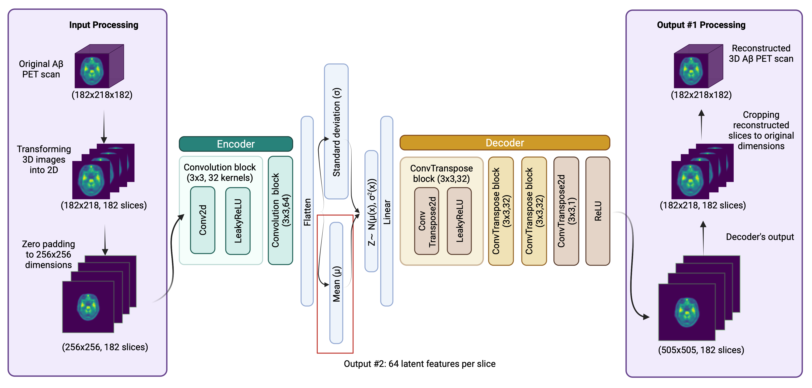
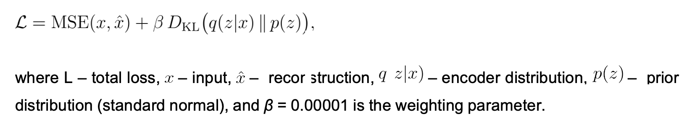

# petVAE
Amyloid positron emission tomography (PET) scans are used to define amyloid-β (Aβ) accumulation, the core biomarker of Alzheimer’s disease (AD).  Typically, individuals are classified as either Aβ-negative or Aβ-positive. However, we developed the model, petVAE, which latent features effectively represent the AD continuum and defined biologically meaningful clusters. Based on petVAE latent features we were able to definde subgroups of Aβ-negative or Aβ-positive individuals that are differ by genetic risk allell, AD biomarkers level or cognitive performence.

# About the model (in process)

The petVAE is a 2D convolutional variational autoencoder (Kingma & Welling, 2019) that contains 1.10 million parameters. 

Input:

The model was trained on [¹⁸F]-AV45 (florbetapir) amyloid PET scans that were pre-registered to the corresponding MRI and to the T1 MNI152 template, with dimensions of 182 × 218 × 182 voxels. For optimal performance, it is recommended to use the same registration template and input dimensions for PET scans. However, due to the model’s internal padding stage, it can also operate on scans with axial slice dimensions smaller than 256 × 256 (i.e., PET scan size < 256 × 256 × n).

Activation function: ReLU (Nair & Hinton, 2010) and LeakyReLU (Maas et al., 2013)

Optimization: Adam optimization algorithm (Kingma & Ba, 2014) with an initial learning rate of 0.00001

Evaluation metrics: Combination Mean Squared Error (MSE) and Kullback–Leibler Divergence (KLD) losses with β = 0.00001 

Number of epochs: maximum of 300 epochs and stopped early, if loss in the validation dataset did not decrease for 10 epochs 

Batch size: 64

# How to use the model
petVAE package is in development

# Authors
Arina A. Tagmazian, Claudia Schwarz, Catharina Lange, Esa Pitkänen, Eero Vuoksimaa

Data used for training and evaluation the model were obtained from the Alzheimer’s Disease Neuroimaging Initiative (ADNI) and Anti-Amyloid Treatment in Asymptomatic Alzheimer's Disease (A4/LEARN) studies. 

Preprint of the manuscript with results is available on [BioRxiv](https://will be here later). 

# References
Kingma DP, Welling M. An Introduction to Variational Autoencoders. arXiv [cs.LG]. 2019. Available: http://arxiv.org/abs/1906.02691
Kingma DP, Ba J. Adam: A Method for Stochastic Optimization. 2014. Available: http://arxiv.org/abs/1412.6980
Nair V, Hinton GE. Rectified linear units improve restricted boltzmann machines. Proceedings of the 27th international conference on machine learning (ICML-10). 2010.
Maas AL, Awni Y, Hannun AY. Rectifier nonlinearities improve neural network acoustic models. Proc icml. 2013;30.
